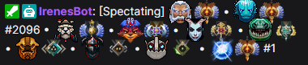
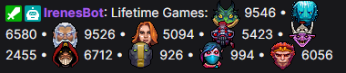
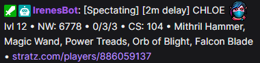
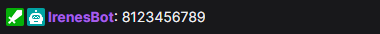
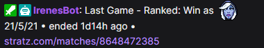
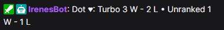
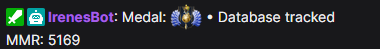
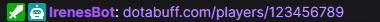

# Chat Commands

## 1. Dota 2

| Command Name | Chat Aliases | Description | Showcase ([7tv emote set](https://7tv.app/emote-sets/01JS1XW1PAAKP34984FDYZVDR7) on) |
| :--- | :--- | :--- | :--- |
| Game Medals | !gm | Show players' rank medals in the current game. |  |
| Ranked | !ranked | Show whether the current game is ranked or not. |  |
| Lifetime Games | !smurfs !lifetime | Show amount of games players in the current game have played on their accounts in total. |  |
| Stats | !stats !items !item !player | Fetch item and some profile data about a certain player in the current game (2 minutes delay). Note that you need to provide an argument for the command such as hero name, hero alias, player slot or color (i.e. !stats pa, !stats blue. !stats mireska !stats Templar Assassin). |  |
| Match ID | !match_id !matchid | Show match id for the current game. |  |
| Notable players | !notable !np | Show notable players from the current game. This includes pro-players, streamers, twitch chatters. Honestly, everybody is welcome to be added as a notable player. | --- |
| Played With | !lg !lm !played | Show recurring players from the last game present in the current game. | --- |
| Previous Match | !pm | Show a short summary for the previous match results. |  |
| Score | !wl !score !winloss | Show streamer's win - loss score ratio during the stream. |  |
| Offline score | !wl offline | Show win - loss ratio for the last streamer's gaming session but also include offline games. |  |
| MMR | !mmr | Show streamer's mmr tracked in the bot database (according to their match history). It is not accurate. |  |
| Set MMR | !mmr set | (Streamer's only command) Allows for streamers to manually update mmr in the bot's database. | --- |
| Profile | !dotabuff !stratz !opendota | Show link to streamer's stats profile page |  |
| Last Seen | !lastseen | Show which account the bot has spotted you playing Dota 2 last on. The bot considers this account as "active" for the purposes of the commands above | --- |

## 2. Meta

| Command Name | Chat Aliases | Description |
| Commands List | !commands !help | Show link to this page |
| Irene | !irene |  |
