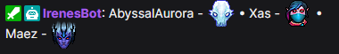
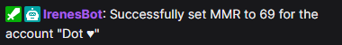
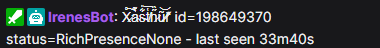
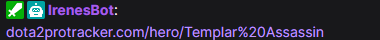

# Chat Commands

## 1. Dota 2

<table>
  <tr>
    <th>Command Name</th>
    <th class="aliases-column">Chat Aliases</th>
    <th>Description</th>
    <th>Showcase (<a href="https://7tv.app/emote-sets/01JS1XW1PAAKP34984FDYZVDR7">7tv emote set</a> on)</th>
  </tr>
  <tr>
    <td>Game Medals</td>
    <td class="aliases-column">!gm</td>
    <td>
      Show rank medal for each players in the match.
    </td>
    <td></td>
  </tr>
  <tr>
    <td>Lifetime Games</td>
    <td class="aliases-column">!smurfs !lifetime</td>
    <td>
      Show total games played for each player in the match.
    </td>
    <td></td>
  </tr>
  <tr>
    <td>Live Match Player Stats</td>
    <td class="aliases-column">!stats !items !item !player</td>
    <td>
      Fetch item and some profile data for a player in the current match (2 minutes delay).
      Note, you need to provide an argument for the command such as hero name, hero alias, player slot or player color.
      I.e. "!stats pa", "!stats blue", "!stats mireska", "!stats Templar Assassin".
    </td>
    <td></td>
  </tr>
  <tr>
    <td>Notable players</td>
    <td class="aliases-column">!notable !np</td>
    <td>
      Show notable players in the match.
      This includes streamers, twitch chatters and pro-players.
      Honestly, everybody is welcome to be added as a notable player.
    </td>
    <td></td>
  </tr>
  <tr>
    <td>Ranked</td>
    <td class="aliases-column">!ranked</td>
    <td>
      Show whether the current match is ranked or not.
    </td>
    <td></td>
  </tr>
  <tr>
    <td>Match ID</td>
    <td class="aliases-column">!match_id !matchid</td>
    <td>
      Show match id for the current game.
    </td>
    <td></td>
  </tr>
  <tr>
    <td>Played with in Last Game</td>
    <td class="aliases-column">!lg !lm !played</td>
    <td>
      Show recurring players from the last game present in the current game.
    </td>
    <td></td>
  </tr>
  <tr>
    <td>Previous Match Results</td>
    <td class="aliases-column">!pm</td>
    <td>
      Show a short summary for the previous match results.
    </td>
    <td></td>
  </tr>
  <tr>
    <td>Win Loss Ratio</td>
    <td class="aliases-column">!wl !score !winloss</td>
    <td>
      Show streamer's win-loss score ratio during the live-stream.
    </td>
    <td></td>
  </tr>
  <tr>
    <td>Offline Win Loss Ratio</td>
    <td class="aliases-column">!wl offline</td>
    <td>
      Show win-loss ratio for the last streamer's gaming session but also include offline games.
    </td>
    <td></td>
  </tr>
  <tr>
    <td>MMR</td>
    <td class="aliases-column">!mmr</td>
    <td>
      Show streamer's mmr tracked in the bot database (according to their match history).
      It is not accurate.
    </td>
    <td></td>
  </tr>
  <tr>
    <td>Set MMR</td>
    <td class="aliases-column">!mmr set</td>
    <td>
      (Streamer's only command) Allows for streamers to manually update their MMR in the bot's database.
    </td>
    <td></td>
  </tr>
  <tr>
    <td>Stats Profile</td>
    <td class="aliases-column">!dotabuff !stratz !opendota</td>
    <td>
      Show link to the streamer's stats profile page.
    </td>
    <td></td>
  </tr>
  <tr>
    <td>Last Seen</td>
    <td class="aliases-column">!lastseen</td>
    <td>
      Show which account the bot has spotted you playing Dota 2 last on.
      The bot considers this account as "active" for the purposes of the commands above.
    </td>
    <td></td>
  </tr>
  <tr>
    <td>D2PT Hero Builds</td>
    <td class="aliases-column">!d2pt</td>
    <td>
      Show Dota 2 ProTracker page for the currently selected hero.
    </td>
    <td></td>
  </tr>
</table>

### Notes and tips

* To make bot responses look like in the "Showcase" column you can merge your main 7tv emote set with <a href="https://7tv.app/emote-sets/01JS1XW1PAAKP34984FDYZVDR7">Dota 2 emote set</a> using a tool like [potat.app/help/mergeset](<https://potat.app/help/mergeset>). Some short instructions for @PotatBotat:
  * Add @PotatBotat to your channel
  * Give it 7tv editor role, allow it to `Create Emote Sets` in addition to default permissions.
  * Use `#mergeset <Primary set ID> 01JS1XW1PAAKP34984FDYZVDR7` where the second argument is an ID for the mentioned Dota 2 emote set.
  * You can find your `<Primary set ID>` by copying the last part of the URL to your own main emote set.
  * @PotatBotat will create a new emote set trying to merge the provided ones. If there are more then 1000 emotes in total - some emotes from the 2nd set won't make it.
* Unfortunately, currently for Dota 2 features to work:
  1. You need to add the bot's steam accounts to friends.
  2. You also need to be green-online 🟢 in Dota 2 (and have rich presence visible to friends) for the bot to be able to see your status live.
* PS. Another implementation for these features (using Dota 2 Game State Integration) is coming soon™️. It won't have mentioned restrictions but you will have to put a `.cfg` file into the Dota 2 directory.

## 2. Meta

<table>
  <tr>
    <th>Command Name</th>
    <th class="aliases-column">Chat Aliases</th>
    <th>Description</th>
  </tr>
  <tr>
    <td>Commands List</td>
    <td class="aliases-column">!commands !help !irenesbot</td>
    <td>Show link to this page.</td>
  </tr>
  <tr>
    <td>Irene</td>
    <td class="aliases-column">!irene</td>
    <td></td>
  </tr>
</table>
